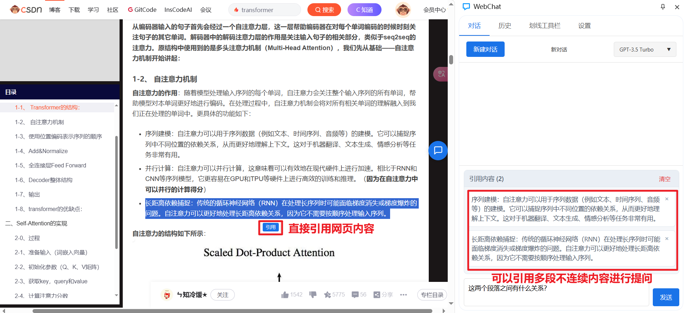
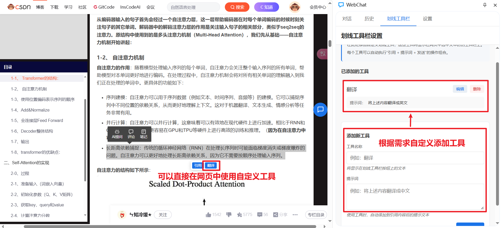
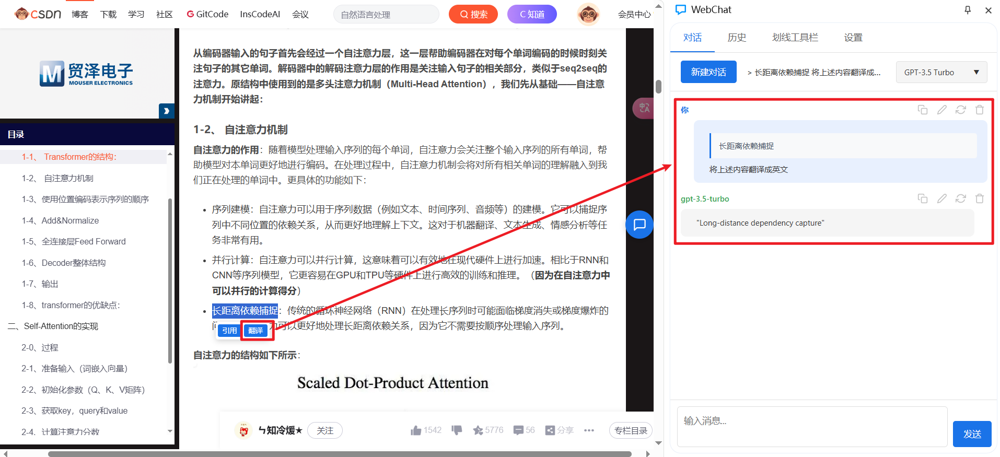
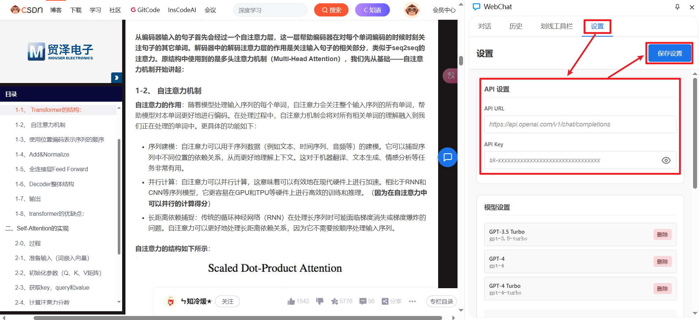
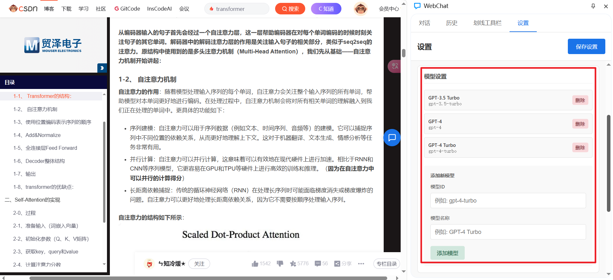
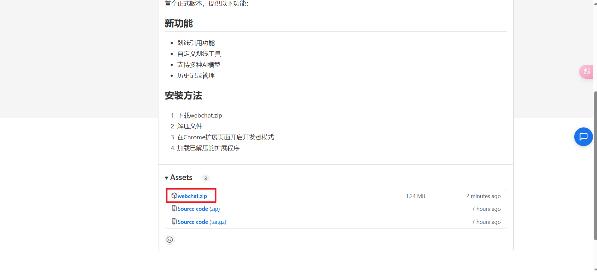
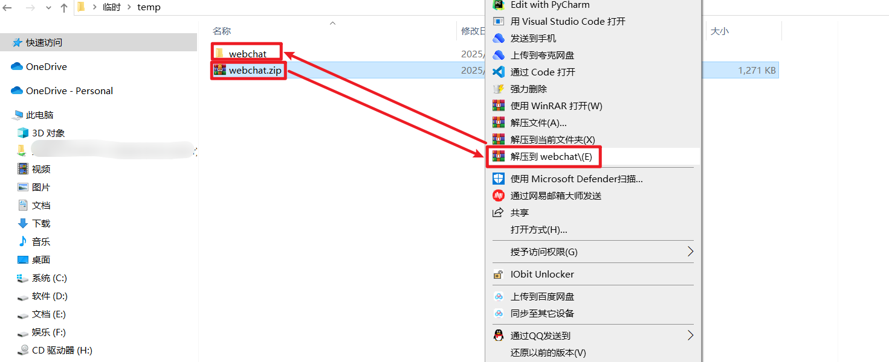
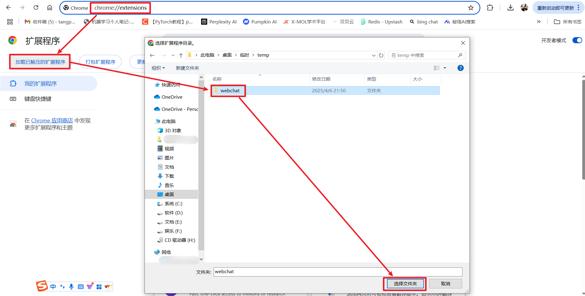
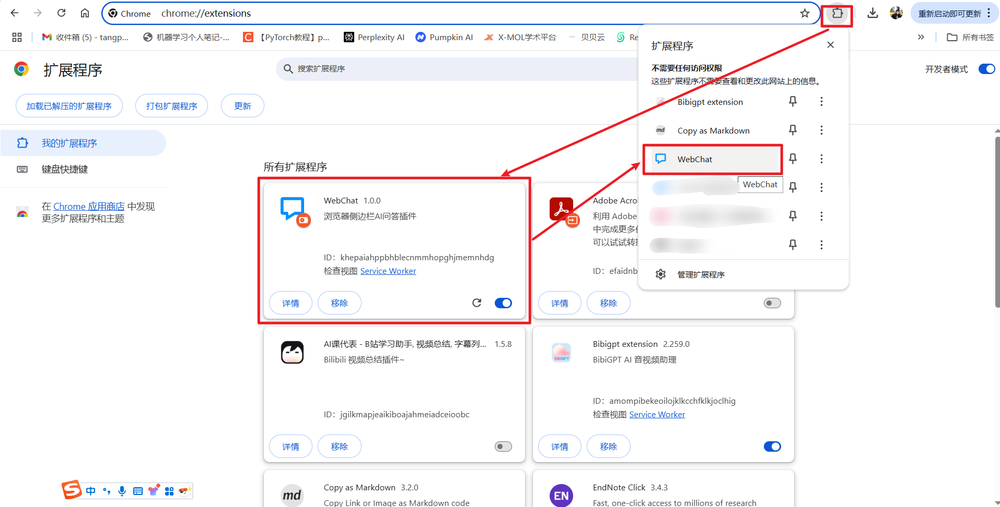
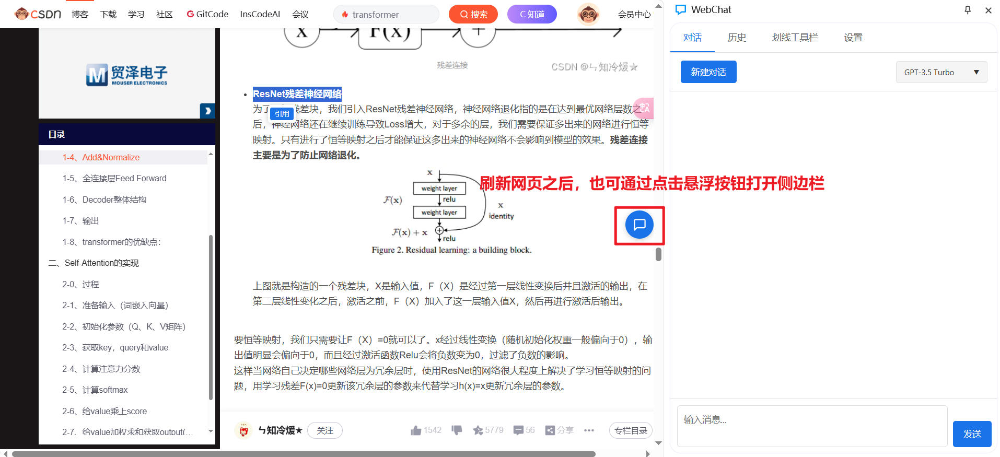

# WebChat 浏览器侧边栏 AI 问答插件

WebChat 是一个功能强大的 Chrome 扩展，可以帮助您在浏览网页时快速引用内容并与 AI 进行交互。

## 使用方法

### 划线引用
1. 选中网页上的任意文本
2. 点击出现的"引用"按钮
3. 引用内容会自动添加到侧边栏中
4. 可以继续选择其他文本进行引用
5. 在输入框中添加问题或直接发送引用内容



### 自定义工具
1. 点击"划线工具栏"选项卡
2. 添加新工具，设置名称和提示词
3. 选中网页文本时，新工具按钮会出现在引用按钮旁边
4. 点击自定义工具按钮，自动引用内容并添加提示词发送




### 自定义模型设置
1. 点击侧边栏右上角的设置图标
2. 在设置面板中选择"设置"选项卡
3. 选择您希望使用的模型
4. 可以添加自定义API密钥和自定义参数




## 主要功能

### 1. 划线引用功能
- 选中网页文本后，会出现引用按钮工具栏
- 支持多段不连续内容的引用
- 所有引用内容显示在输入框上方，可随时编辑或删除

### 2. 自定义划线工具
- 通过"划线工具栏"选项卡添加自定义工具
- 每个工具可以配置名称和提示词
- 选中文本后一键执行"引用+提示词+发送"的操作组合

### 3. 聊天功能
- 支持 GPT-3.5、GPT-4 等多种模型
- 流式响应，实时显示 AI 回复
- 支持停止生成、重新生成等操作

### 4. 历史记录管理
- 自动保存所有对话
- 历史记录可随时查看和恢复
- 支持编辑和删除历史消息

### 5. 界面特性
- 悬浮按钮可拖动且紧贴屏幕边缘
- 支持消息复制、删除等快捷操作

## 安装方法

### 方法一：直接安装发布版本（推荐）

1. 前往本项目的 [Releases](https://github.com/tangpan360/webchat/releases) 页面
2. 下载最新版本的 `webchat.zip` 文件
3. 解压下载的文件到本地文件夹
4. 在 Chrome 浏览器中打开 `chrome://extensions/`
5. 开启右上角的"开发者模式"
6. 点击"加载已解压的扩展程序"
7. 选择解压后的文件夹
8. 扩展安装完成后，图标将显示在浏览器工具栏







### 方法二：从源码构建安装（开发者）

1. 首先，克隆或下载本仓库到本地：
   ```bash
   git clone https://github.com/tangpan360/webchat.git
   cd webchat
   ```

2. 安装项目依赖：
   ```bash
   npm install
   ```

3. 构建项目：
   ```bash
   npm run build
   ```
   这将在项目根目录下生成一个 `dist` 文件夹，其中包含扩展所需的所有文件。

4. 在 Chrome 浏览器中加载扩展：
   - 打开 Chrome 浏览器，在地址栏输入 `chrome://extensions/`
   - 在右上角开启"开发者模式"
   - 点击"加载已解压的扩展程序"按钮
   - 选择项目中的 `dist` 目录
   - 成功后，扩展图标将出现在浏览器工具栏中

## 开发指南

### 开发模式

如果您想在开发模式下运行：

```bash
npm start
```

这将启动开发服务器，当您修改代码时，扩展会自动重新构建。重新构建后，您需要在 `chrome://extensions/` 页面点击扩展卡片上的"刷新"按钮或重新加载扩展。

### 项目结构

本项目使用 React 构建，主要文件结构：

- `/src` - 源代码目录
  - `/components` - React 组件
  - `/assets` - 样式和资源文件
  - `/utils` - 工具函数
  - `/api` - API 调用
- `/public` - 静态资源和扩展配置
- `/dist` - 构建输出目录（不包含在源码仓库中）

### 发布流程

如果您是项目维护者并想发布新版本：

1. 更新 `manifest.json` 中的版本号
2. 构建项目：`npm run build`
3. 将 `dist` 目录中的所有文件压缩为 zip 文件：
   ```bash
   cd dist
   zip -r ../webchat.zip *
   ```
4. 在 GitHub 创建新的 Release，上传 zip 文件作为附件

## 技术特性

- 使用 React 构建用户界面
- 使用 Chrome 扩展 API 实现跨页面通信
- 支持 Markdown 渲染，包括代码高亮和公式
- 本地存储聊天历史和用户配置

## 贡献指南

欢迎提交 Pull Request 或 Issue 来改进这个项目！

1. Fork 本仓库
2. 创建您的功能分支: `git checkout -b feature/amazing-feature`
3. 提交您的更改: `git commit -m '添加了一些很棒的功能'`
4. 推送到分支: `git push origin feature/amazing-feature`
5. 提交 Pull Request
